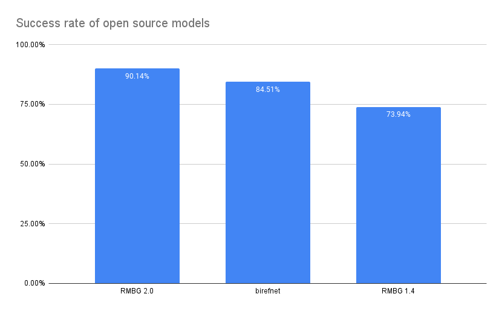

# BRIA Background Removal v2.0 Model Card

RMBG v2.0 is our new state-of-the-art background removal model significantly improves RMBG v1.4. The model is designed to effectively separate foreground from background in a range of
categories and image types. This model has been trained on a carefully selected dataset, which includes:
general stock images, e-commerce, gaming, and advertising content, making it suitable for commercial use cases powering enterprise content creation at scale. 
The accuracy, efficiency, and versatility currently rival leading source-available models. 
It is ideal where content safety, legally licensed datasets, and bias mitigation are paramount. 

Developed by BRIA AI, RMBG v2.0 is available as a source-available model for non-commercial use.

### Get Access

Bria RMBG2.0 is availabe everywhere you build, either as source-code and weights, ComfyUI nodes or API endpoints.

- **Purchase:** for commercial license simply click [Here](https://go.bria.ai/3D5EGp0).
- **API Endpoint**: [Bria.ai](https://platform.bria.ai/console/api/image-editing), [fal.ai](https://fal.ai/models/fal-ai/bria/background/remove)
- **ComfyUI**: [Use it in workflows](https://github.com/Bria-AI/ComfyUI-BRIA-API)

For more information, please visit our [website](https://bria.ai/).

Join our [Discord community](https://discord.gg/Nxe9YW9zHS) for more information, tutorials, tools, and to connect with other users!

[CLICK HERE FOR A DEMO](https://huggingface.co/spaces/briaai/BRIA-RMBG-2.0)

Join our [Discord community](https://discord.gg/Nxe9YW9zHS) for more information, tutorials, tools, and to connect with other users!


## Model Details
#####
### Model Description

- **Developed by:** [BRIA AI](https://bria.ai/)
- **Model type:** Background Removal 
- **License:** [Creative Commons Attribution–Non-Commercial (CC BY-NC 4.0)](https://creativecommons.org/licenses/by-nc/4.0/deed.en)
  - The model is released under a CC BY-NC 4.0 license for non-commercial use.
  - Commercial use is subject to a commercial agreement with BRIA. Available [here](https://share-eu1.hsforms.com/2sj9FVZTGSFmFRibDLhr_ZAf4e04?utm_campaign=RMBG%202.0&utm_source=Hugging%20face&utm_medium=hyperlink&utm_content=RMBG%20Hugging%20Face%20purchase%20form)

  **Purchase:** to purchase a commercial license simply click [Here](https://go.bria.ai/3D5EGp0).

- **Model Description:** BRIA RMBG-2.0 is a dichotomous image segmentation model trained exclusively on a professional-grade dataset.
- **BRIA:** Resources for more information: [BRIA AI](https://bria.ai/)


## Training data
Bria-RMBG model was trained with over 15,000 high-quality, high-resolution, manually labeled (pixel-wise accuracy), fully licensed images.
Our benchmark included balanced gender, balanced ethnicity, and people with different types of disabilities.
For clarity, we provide our data distribution according to different categories, demonstrating our model’s versatility.

### Distribution of images:

| Category | Distribution |
| -----------------------------------| -----------------------------------:|
| Objects only | 45.11% |
| People with objects/animals | 25.24% |
| People only | 17.35% |
| people/objects/animals with text | 8.52% |
| Text only | 2.52% |
| Animals only | 1.89% |

| Category | Distribution |
| -----------------------------------| -----------------------------------------:|
| Photorealistic | 87.70% |
| Non-Photorealistic | 12.30% |


| Category | Distribution |
| -----------------------------------| -----------------------------------:|
| Non Solid Background | 52.05% |
| Solid Background | 47.95% 


| Category | Distribution |
| -----------------------------------| -----------------------------------:|
| Single main foreground object | 51.42% |
| Multiple objects in the foreground | 48.58% |


## Qualitative Evaluation
Open source models comparison



### Architecture
RMBG-2.0 is developed on the [BiRefNet](https://github.com/ZhengPeng7/BiRefNet) architecture enhanced with our proprietary dataset and training scheme. This training data significantly improves the model’s accuracy and effectiveness for background-removal task.<br>
If you use this model in your research, please cite:

```
@article{BiRefNet,
  title={Bilateral Reference for High-Resolution Dichotomous Image Segmentation},
  author={Zheng, Peng and Gao, Dehong and Fan, Deng-Ping and Liu, Li and Laaksonen, Jorma and Ouyang, Wanli and Sebe, Nicu},
  journal={CAAI Artificial Intelligence Research},
  year={2024}
}
```

#### Requirements
```bash
torch
torchvision
pillow
kornia
transformers
```

### Usage

<!-- This section is for the model use without fine-tuning or plugging into a larger ecosystem/app. -->


```python
from PIL import Image
import matplotlib.pyplot as plt
import torch
from torchvision import transforms
from transformers import AutoModelForImageSegmentation

model = AutoModelForImageSegmentation.from_pretrained('briaai/RMBG-2.0', trust_remote_code=True)
torch.set_float32_matmul_precision(['high', 'highest'][0])
model.to('cuda')
model.eval()

# Data settings
image_size = (1024, 1024)
transform_image = transforms.Compose([
    transforms.Resize(image_size),
    transforms.ToTensor(),
    transforms.Normalize([0.485, 0.456, 0.406], [0.229, 0.224, 0.225])
])

image = Image.open(input_image_path)
input_images = transform_image(image).unsqueeze(0).to('cuda')

# Prediction
with torch.no_grad():
    preds = model(input_images)[-1].sigmoid().cpu()
pred = preds[0].squeeze()
pred_pil = transforms.ToPILImage()(pred)
mask = pred_pil.resize(image.size)
image.putalpha(mask)

image.save("no_bg_image.png")
```

